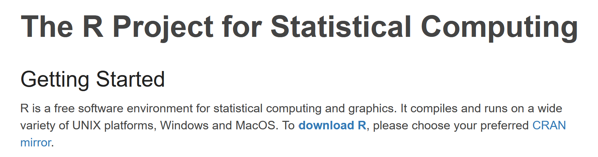
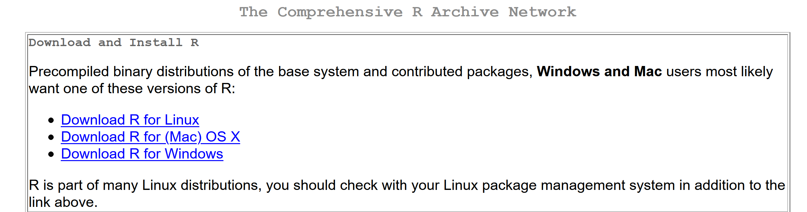
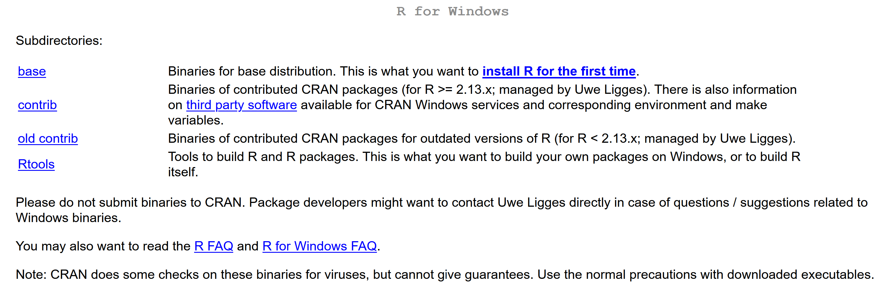

## Installing R

To install R, you can go to <https://www.r-project.org/> and click the **download R** link.

Select a CRAN mirror location near you (scroll down to near the bottom for locations in the US). On the next page, select the link corresponding to your operating system.

The following page provides additional options - typically, you will want to choose **install R for the first time** and click the download link on the next page. You can then follow the instructions of the installation wizard for the downloaded file to install R on your system.

Return to:
[Prerequisites](C01_P000_Prerequisites.md);
[Sections](C00_P002_Chapters.md);
[Home page](https://rettopnivek.github.io/R_training/)
