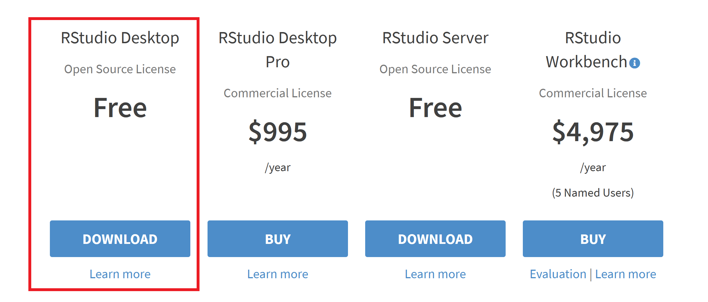
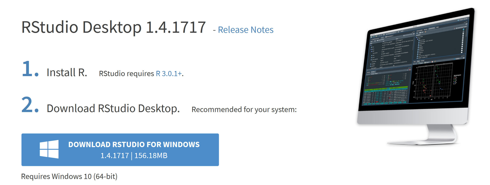

## Installing RStudio

RStudio provides a more feature-rich graphical user interface (GUI) for using R and writing R scripts. It is highly recommended to install RStudio if you plan on using R extensively.

To install RStudio, you can go to <https://rstudio.com/products/rstudio/download/> and choose the Download link.

The RStudio webpage should then automatically determine the appropriate link for the installer matching your operating system - if everything looks correct, you can click the download button.

As before, you can then follow the instructions of the installation wizard for the downloaded file to install RStudio on your system.

Return to:
[RStudio](C02_P000_RStudio.md);
[Sections](C00_P002_Chapters.md);
[Home page](https://rettopnivek.github.io/R_training/)

