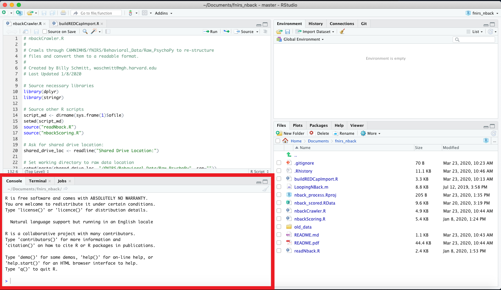
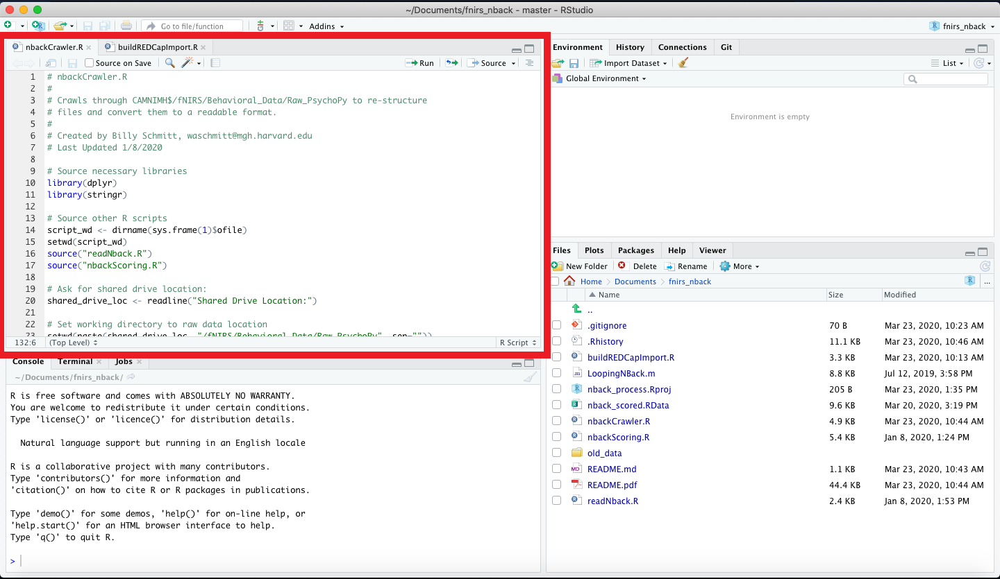
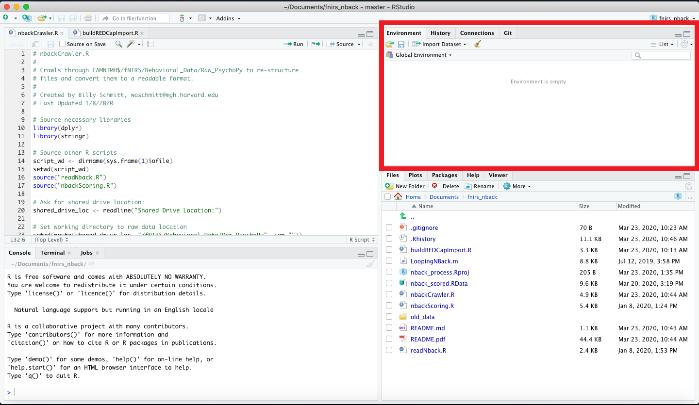
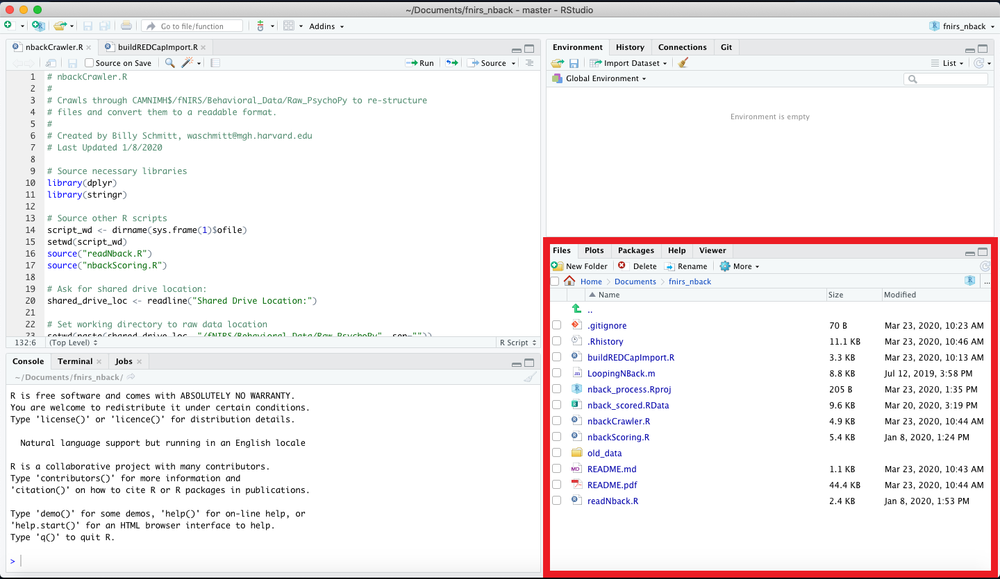

## Using RStudio

RStudio provides a feature-rich interface for programming in R, providing a large suite of options for code editing, file manipulation, visualization tools, and debugging. In the following, we discuss the four panes that make up RStudio's display.

*Note: RStudio is an example of an Integrated Development Environment (IDE)*.

### Table of contents
1. <a href="#S01">The Console window (for input and output when programming in R)</a>
2. <a href="#S02">The Source window (where R scripts are shown)</a>
3. <a href="#S03">The Environment window (listing variables and data currently available in the R workspace)</a>
4. <a href="#S04">The Viewer window (e.g., for displaying figures)</a>

<a href="#END">&#129147;</a>

*Note: You can edit the arrangment and content of these four panes by selecting 'Tools' in the file menu, and then selecting 'Global options'. In the pop-up window, click 'Pane layout' to change how you want your panes arranged).*

#### 1. The Console Window

The __Console__ window allows you to directly type commands for R to process. The __Console__ window then displays the results of these commands, or if you run a R script, the results of running all the commands listed in the script.

<a href="#TOC">&#129145;</a> <a href="#END">&#129147;</a>

#### 2. The Source Window

The __Source__ window displays R script files. To create a new R script, go to 'File' in the file menu, click 'New file' and choose 'R Script' (*The keyboard shortcut is Ctrl+Shft+N, as listed on the right*). Multiple scripts can be open at once, in which case the __Source__ window provides a series of tabs with the file name associated with each script. Clicking on a tab displays that given script in the __Source__ window, and you can then edit the script at your leisure.

At the top right of the __Source__ window, there are two buttons. If you set your cursor on a line with a command, or highlight a sequence of commands, you can tell R to process this selection of commands and display the results in the __Console__ window (i.e., 'run' the commands) by clicking 'Run'. To run the entire set of commands in a R script, you can click on the 'Source' button. At the top left of the __Source__ window, there are additional buttons to help with writing scripts. Two of the most useful are the 'Save' button (the floppy disk icon), and the 'Search' option (the magnifying glass). Also, by default RStudio provides code highlighting, using different color schemes to make R code more readable and easy to understand.

*Note: You can change the style and appearance of the code highlighting in the 'Global options' pop-up window under the 'Appearances' tab. You can also change indenting and auto-complete options in the 'Code' tab.*

<a href="#TOC">&#129145;</a> <a href="#END">&#129147;</a>

#### 3. The Environment Window

The __Environment__ window provides several useful tabs. The 'Environment' tab lists the various objects that are currently defined in your R workspace (e.g., values, variables, and functions). You can delete all objects in your workspace, by clicking the 'broom' icon located at the top below the list of tabs. You can save all objects in your workspace by clicking the 'disk' symbol. You can load in previously saved workspaces (with the extension '.RData') by clicking the folder icon.

<a href="#TOC">&#129145;</a> <a href="#END">&#129147;</a>

#### 4. The Viewer window

The __Viewer__ window also provides several useful tabs - of particular interest here are the 'Plots', 'Packages', 'Files', and 'Help' tabs.

The 'Files' tab displays the folders and files located in R's current working directory. R can access files in this directory without having to specify the full path. You can change the working directory by clicking 'Session' in the file menu, selecting 'Set Working Directory', and then selecting on of the options in the pull-down menu.

The 'Packages' tab displays all R packages installed on your computer. R packages that are currently loaded have a check mark, and clicking an unchecked box will promptly load in the associated R package.

The 'Plots' tab displays any figures that R has generated. The arrow keys allow viewing previously generated figures. You can save a created figure by selected the 'Export' icon, and you can clear all figures from the viewer by clicking the 'broom' icon.

The 'Help' tab displays entries from R's documentation (e.g., the documentation for a function). You can use this tab to search over all the documentation pages, via the search bar at the top right of the tab. To search for phrases within a specific help page, you can use the other search bar located at the top left, beneath the list of tabs.

<a href="#TOC">&#129145;</a>

Return to:
[RStudio](C02_P000_RStudio.md);
[Sections](C00_P002_Chapters.md);
[Home page](https://rettopnivek.github.io/R_training/)
