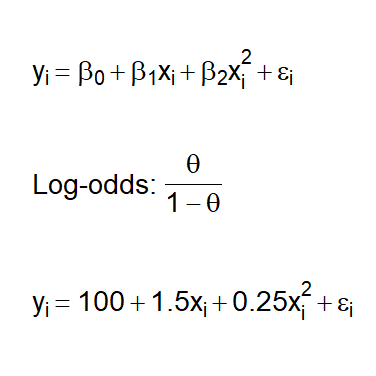
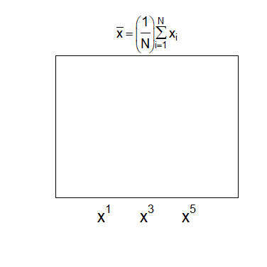
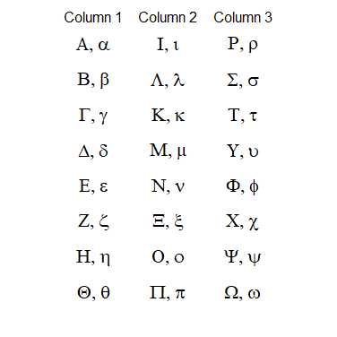

## Mathematical annotations in plots

Base R supports an array of mathematical expressions obeying TeX-like rules that can be added to a figure. Adding mathematical notation proceeds via two steps. First, a mathematical expression is defined via the **expression** or **substitute** command. The expression is then added to an existing figure via the **text**, **mtext**, **axis**, and **legend** commands. The command ```?plotmath``` provides a breakdown of the notation used for define various equations, relations, and symbols.

<a name="TOC"></a>
### Table of contents
1. <a href="#S01">Mathematical annotations via **text**</a>
2. <a href="#S02">Mathematical annotations via **mtext**, **axis**, or **legend**</a>
3. <a href="#S03">Greek letters</a>

<a href="#END">&#129147;</a>

<a name="S01"></a>
#### 1. Mathematical annotations via **text**

Content.

```R
# Define regression equation via 
# 'expression' and 'plotmath'
mtxt <- expression(
  y[i] == beta[0] + beta[1]*x[i] + beta[2]*x[i]^2 + epsilon[i]
)
# Add to figure
text( 0, .85, mtxt, pos = 4, cex = 1.75 )

# Combining regular text and equations
# via 'expression', 'paste', and 'plotmath'
mtxt <- expression(
  paste(
    "Log-odds: ",
    frac( theta, 1 - theta )
  )
)
# Add to figure
text( 0, .5, mtxt, pos = 4, cex = 1.75 )

# Sustituting values from a variable via 
# 'substitute' and 'plotmath'
vec <- c( 100, 1.5, 0.25 ) # Vector of coefficients
mtxt <- substitute(
  y[i] == b_0 + b_1*x[i] + b_2*x[i]^2 + epsilon[i],
  list( b_0 = vec[1], b_1 = vec[2], b_2 = vec[3] )
)
# Add to figure
text( 0, .15, mtxt, pos = 4, cex = 1.75 )
```



<a href="#TOC">&#129145;</a> <a href="#END">&#129147;</a>

<a name="S02"></a>
#### 2. Mathematical annotations via **mtext** or **axis**

Content.

```R
# Define summation and division via 
# 'expression' and 'plotmath'
mtxt <- expression(
  bar(x) == bgroup( "(", frac( 1, N ), ")" )*sum( x[i], i == 1, N )
)
# Add as figure's title
mtext( mtxt, side = 3, cex = 1.15 )

# Define vector of expressions
mtxt <- c(
  expression( x^1 ),
  expression( x^3 ),
  expression( x^5 )
)
# Add to figure axis
axis( 1, c( .25, .5, .75 ), mtxt, cex.axis = 1.5, tick = F )
```



<a href="#TOC">&#129145;</a> <a href="#END">&#129147;</a>

<a name="S03"></a>
#### 3. Greek letters

Content.

```R
# Greek alphabet

greek_alphabet <- list(
  # Column 1
  expression( list( Alpha, alpha ) ),
  expression( list( Beta, beta ) ),
  expression( list( Gamma, gamma ) ),
  expression( list( Delta, delta ) ),
  expression( list( Epsilon, epsilon ) ),
  expression( list( Zeta, zeta ) ),
  expression( list( Eta, eta ) ),
  expression( list( Theta, theta ) ),
  # Column 2
  expression( list( Iota, iota ) ),
  expression( list( Lambda, lambda ) ),
  expression( list( Kappa, kappa ) ),
  expression( list( Mu, mu ) ),
  expression( list( Nu, nu ) ),
  expression( list( Xi, xi ) ),
  expression( list( Omicron, omicron ) ),
  expression( list( Pi, pi ) ),
  # Column 3
  expression( list( Rho, rho ) ),
  expression( list( Sigma, sigma ) ),
  expression( list( Tau, tau ) ),
  expression( list( Upsilon, upsilon ) ),
  expression( list( Phi, phi ) ),
  expression( list( Chi, chi ) ),
  expression( list( Psi, psi ) ),
  expression( list( Omega, omega ) )
)

# x-axis coordinate
xc <- rep( c(.2,.5,.8), each = 8 )
# y-axis coordinates
yc <- rep( seq( 1, 0, length.out = 8 ), 3 )
# Text size
sz <- 1.3

for ( i in 1:24 ) {
  text( xc[i], yc[i], greek_alphabet[[i]], cex = sz )
}
axis( 3, c(.2,.5,.8), paste0( 'Column ', 1:3 ), 
      tick = F, line = -.5 )
```



<a href="#TOC">&#129145;</a>

<a name="END"></a>
Return to:
[FAQ](C06_P000_FAQ.md);
[Sections](C00_P002_Chapters.md);
[Home page](https://rettopnivek.github.io/R_training/)

